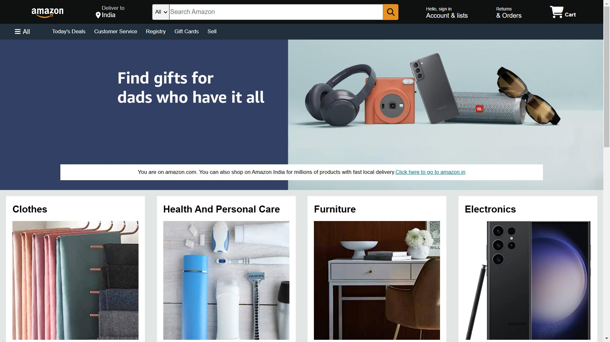

<h1 align="center">🛍️ Online Store Frontend</h1>

  A clean, responsive e-commerce homepage built with pure HTML and CSS. 
  <em>Crafted for learning frontend fundamentals — no frameworks, no JavaScript.</em>

  

---

## ✨ About This Project

This project replicates the layout and look of a modern e-commerce homepage. It's a personal project created to strengthen HTML & CSS skills through hands-on practice.

> ⚠️ **Disclaimer**: This project is intended for educational purposes only and is **not affiliated with or endorsed by Amazon** or any other brand.

---

## 🛠️ Tech Stack

| Tech | Description |
|------|-------------|
| 🧱 **HTML5** | Structure and content |
| 🎨 **CSS3** | Styling and layout |
| ⭐ **Font Awesome** | Icons and visuals |

---

## 📦 Features

- ✅ Fully structured HTML5 layout
- 🎯 Navigation bar with search functionality (non-functional placeholder)
- 🛍️ Product category boxes with images
- 📱 Responsive design principles using Flexbox
- 🦶 Footer with categorized links and sections

---